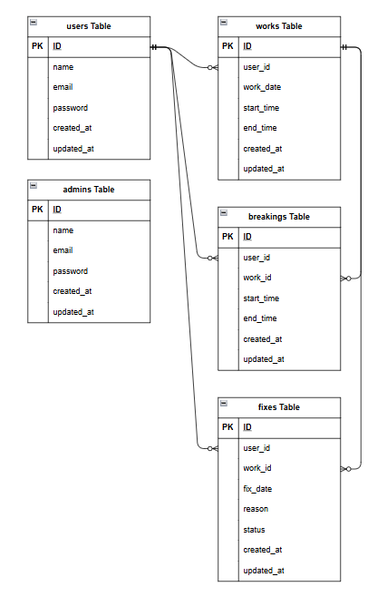

# attendance management app

## プロジェクトの概要

**サービス名**:coachtech 勤怠管理アプリ<br>
**サービス概要**:ある企業が開発した独自の勤怠管理アプリ<br>
**制作の背景と目的**:ユーザーの勤怠と管理を目的とする<br>

## 環境構築

**Docker ビルド**

1. ターミナルで以下コマンドを実行<br>

```bash
git clone git@github.com:LesserPand8/attendance-management-app.git
```

2. ターミナルで以下コマンドを実行<br>

```bash
cd attendance-management-app
```

3. DockerDesktop アプリを立ち上げる
4. ターミナルで以下コマンドを実行<br>

```bash
docker-compose up -d --build
```

**Laravel 環境構築**

1. ターミナルで以下コマンドを実行<br>

```bash
docker-compose exec php bash
```

2. ターミナルで以下コマンドを実行<br>

```bash
composer install
```

3. 「.env.example」ファイルを 「.env」ファイルに命名を変更。<br>
   または、新しく.env ファイルを作成（新規作成する場合のコマンド：cp .env.example .env）
4. 「.env」ファイルで以下の環境変数に修正する

```text
DB_CONNECTION=mysql
DB_HOST=mysql
DB_PORT=3306
DB_DATABASE=laravel_db
DB_USERNAME=laravel_user
DB_PASSWORD=laravel_pass

MAIL_FROM_ADDRESS=example@example.com
MAIL_FROM_NAME="勤怠アプリ"
```

6. ターミナルで以下コマンドを実行<br>

```bash
exit
```

7. 「.env」ファイルを保存する<br>
   保存できない場合は、ターミナルで以下コマンドを実行<br>

```bash
sudo chmod -R 777 *
```

8. ターミナルで以下コマンドを実行<br>

```bash
docker-compose exec php bash
```

9. アプリケーションキーの作成

```bash
php artisan key:generate
```

10. マイグレーションの実行

```bash
php artisan migrate
```

11. シーディングの実行

```bash
php artisan db:seed
```

12. ターミナルで以下コマンドを実行<br>

```bash
exit
```

## テストアカウント

name: 一般ユーザ 1  
email: user1@example.com  
password: testtest

---

name: 一般ユーザ 2  
email: user2@example.com  
password: testtest

---

name: 管理者ユーザ  
email: admin1@example.com  
password: admintest

---

## PHPUnit でのテストについて

**テスト準備**

1. テスト用データベースの作成<br>
   パスワードは root と入力

```bash
docker-compose exec mysql bash
mysql -u root -p
create database demo_test;
exit
exit
```

2. config ファイルの変更<br>
   config ディレクトリの中の database.php を開き、mysql_test が以下のようになっていることを確認する<br>
   ※無い場合は mysql の配列部分をコピーして以下に新たに mysql_test を作成する

```text
'mysql' => [
// 中略
],

'mysql_test' => [
            'driver' => 'mysql',
            'url' => env('DATABASE_URL'),
            'host' => env('DB_HOST', '127.0.0.1'),
            'port' => env('DB_PORT', '3306'),
            'database' => 'demo_test',
            'username' => 'root',
            'password' => 'root',
            'unix_socket' => env('DB_SOCKET', ''),
            'charset' => 'utf8mb4',
            'collation' => 'utf8mb4_unicode_ci',
            'prefix' => '',
            'prefix_indexes' => true,
            'strict' => true,
            'engine' => null,
            'options' => extension_loaded('pdo_mysql') ? array_filter([
                PDO::MYSQL_ATTR_SSL_CA => env('MYSQL_ATTR_SSL_CA'),
            ]) : [],
],
```

3. テスト用の.env ファイル作成

```bash
docker-compose exec php bash
cp .env .env.testing
```

4. 「.env.testing」ファイルの文頭部分にある APP_ENV と APP_KEY を以下のように修正する

```text
APP_ENV=test
APP_KEY=
```

5. 「.env.testing」ファイルにデータベースの接続情報を以下のように修正する

```text
DB_CONNECTION=mysql_test
DB_HOST=mysql
DB_PORT=3306
DB_DATABASE=demo_test
DB_USERNAME=root
DB_PASSWORD=root
```

6. アプリケーションキーの作成

```bash
php artisan key:generate --env=testing
```

7. キャッシュの削除

```bash
php artisan config:clear
```

8. マイグレーションの実行

```bash
php artisan migrate --env=testing
```

9. phpunit の編集<br>
   プロジェクトの直下の phpunit.xml を開き、DB_CONNECTION と DB_DATABASE を以下のようになっていることを確認する<br>
   なっていない場合は変更する

```text
<?xml version="1.0" encoding="UTF-8"?>
<phpunit xmlns:xsi="http://www.w3.org/2001/XMLSchema-instance"
xsi:noNamespaceSchemaLocation="./vendor/phpunit/phpunit/phpunit.xsd"
bootstrap="vendor/autoload.php"
colors="true"
>
<testsuites>
    <testsuite name="Unit">
        <directory suffix="Test.php">./tests/Unit</directory>
    </testsuite>
    <testsuite name="Feature">
        <directory suffix="Test.php">./tests/Feature</directory>
    </testsuite>
</testsuites>
<coverage processUncoveredFiles="true">
    <include>
        <directory suffix=".php">./app</directory>
    </include>
</coverage>
    <php>
        <server name="APP_ENV" value="testing"/>
        <server name="BCRYPT_ROUNDS" value="4"/>
        <server name="CACHE_DRIVER" value="array"/>
        <!-- <server name="DB_CONNECTION" value="sqlite"/> -->
        <!-- <server name="DB_DATABASE" value=":memory:"/> -->
        <server name="DB_CONNECTION" value="mysql_test"/>
        <server name="DB_DATABASE" value="demo_test"/>
        <server name="MAIL_MAILER" value="array"/>
        <server name="QUEUE_CONNECTION" value="sync"/>
        <server name="SESSION_DRIVER" value="array"/>
        <server name="TELESCOPE_ENABLED" value="false"/>
    </php>
</phpunit>
```

**テスト実行**

1. テストの実行をするため、以下コマンドと実施する

```bash
vendor/bin/phpunit
```

## URL

- 勤怠画面：http://localhost/attendance
- 一般ユーザーログイン画面：http://localhost/login
- 管理者ログイン画面：http://localhost/admin/login
- phpMyAdmin：http://localhost:8080/
- mailhog：http://localhost:8025/

## ER 図



## 使用技術(実行環境)

- PHP 8.3.0
- Laravel 8.83.27
- MySQL 8.0.26
- nginx 1.21.1
- Docker / Docker Compose
- phpMyAdmin
- Mailhog
- Node.js
- Composer

## 備考

機能要件シートとテストケース一覧シートで以下の内容について差異があり、機能要件シートに合わせる形にしています。

- 出勤時間が退勤時間より後になっている場合，および退勤時間が出勤時間より前になっている場合のバリデーションメッセージ」
